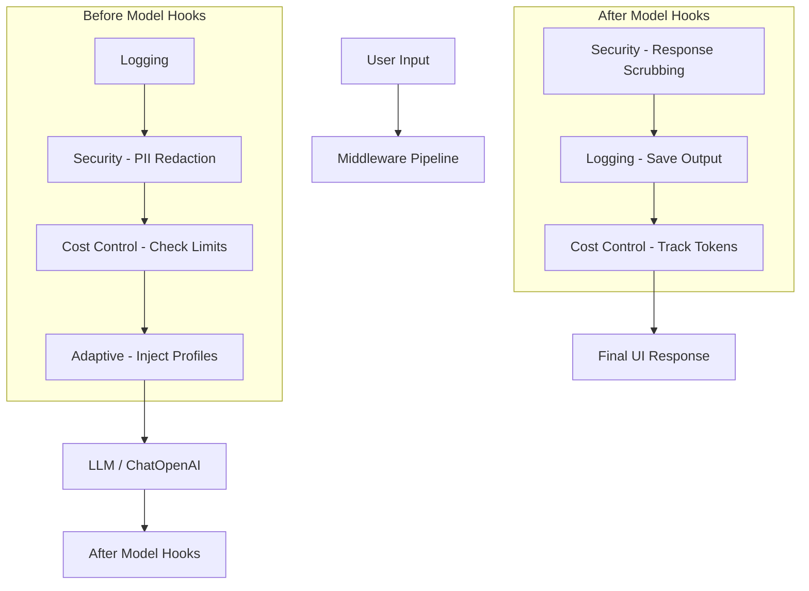

# Middleware-Enhanced Conversational Agent

A production-ready customer support chatbot built with **LangChain** that implements a systematic middleware layer for logging, security, cost control, and adaptive behavior.

## 🌟 Features

- **Logging & Analytics**: Tracks user inputs and model responses for monitoring.
- **Security Filtering**: Automatically redacts PII (Emails, Phone Numbers) using **Microsoft Presidio** before logging or processing.
- **Cost Control**: Enforces token limits per user session to prevent runaway API costs.
- **Adaptive Responses**: Dynamically adjusts model behavior/style based on user profiles or tiers (e.g., Premium vs. Free).

---

## 🏗 Architecture

The project uses a pipeline of middleware hooks that intercept the flow of data between the user and the Language Model.



---

## 🚀 Getting Started

### 1. Prerequisites
- Python 3.10+
- OpenAI API Key

### 2. Installation
```bash
# Clone the repository
git clone https://github.com/Vaibhavee89/Conversational-Agent-using-LangChain-Middleware.git
cd Conversational-Agent-using-LangChain-Middleware

# Create virtual environment
python3 -m venv venv
source venv/bin/activate

# Install dependencies
pip install -r requirements.txt

# Download NLP model for PII detection
python -m spacy download en_core_web_lg
```

### 3. Configuration
Create a `.env` file in the root directory:
```env
OPENAI_API_KEY=your_openai_api_key_here
```

---

## 💻 Usage

### Streamlit Web Interface (Recommended)
Launch the interactive web UI to chat with the agent and monitor middleware metrics in real-time.
```bash
streamlit run streamlit_app.py
```

### Command Line Interface
Run a simple interactive loop in your terminal.
```bash
python main.py
```

---

## 🧪 Example Test Queries

| Feature | Query | Expected Behavior |
| :--- | :--- | :--- |
| **Security** | "My email is test@test.com" | Logs will show `My email is <EMAIL_ADDRESS>`. |
| **Adaptation** | "Explain GPT" (Select `user_1`) | Provides a detailed, premium-style response. |
| **Adaptation** | "Explain GPT" (Select `user_2`) | Provides a short, concise response. |
| **Cost Control** | Ask for a long essay. | Sidebar updates "Tokens Used"; fails at 2000 tokens. |

---

## 📂 Project Structure

- `middleware/`: Contains modular middleware components.
- `agent.py`: Wrapper for the LangChain agent and pipeline integration.
- `streamlit_app.py`: Streamlit UI entry point.
- `main.py`: CLI entry point.
- `verify_middleware.py`: Unit tests for middleware logic.

---

## 🛠 Built With
- [LangChain](https://docs.langchain.com/) - LLM Orchestration
- [Microsoft Presidio](https://microsoft.github.io/presidio/) - PII Identification
- [Streamlit](https://streamlit.io/) - Web UI
